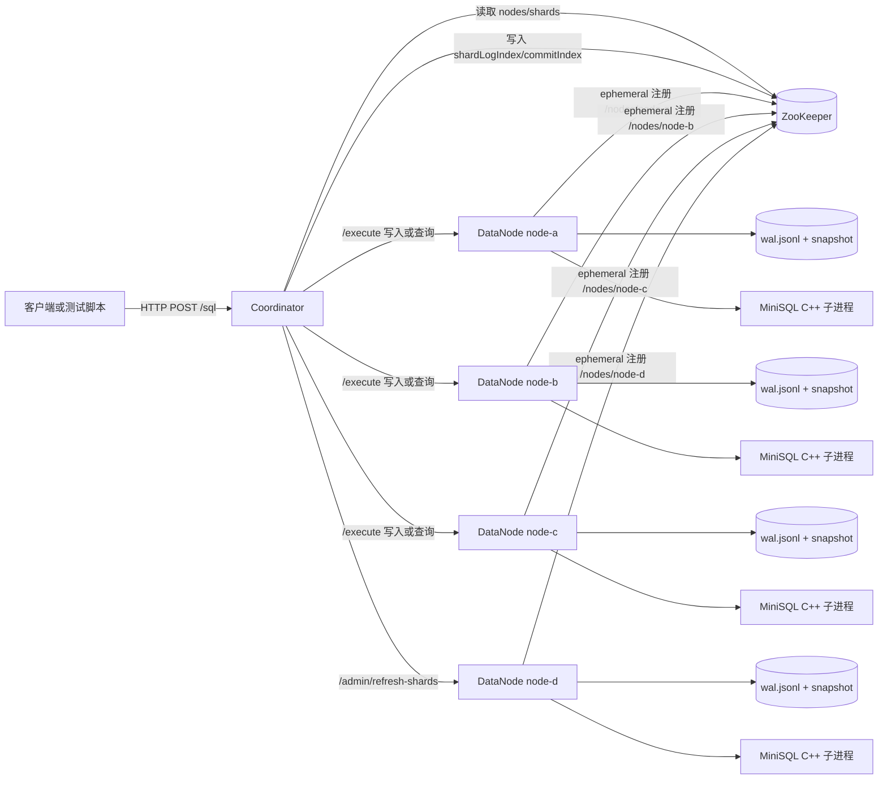
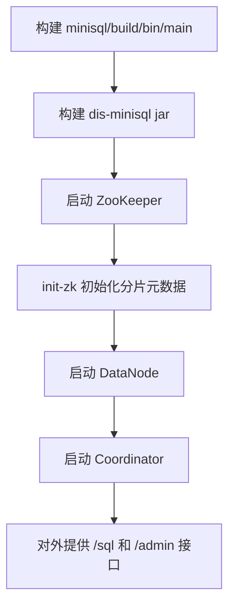
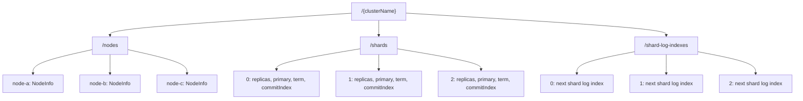
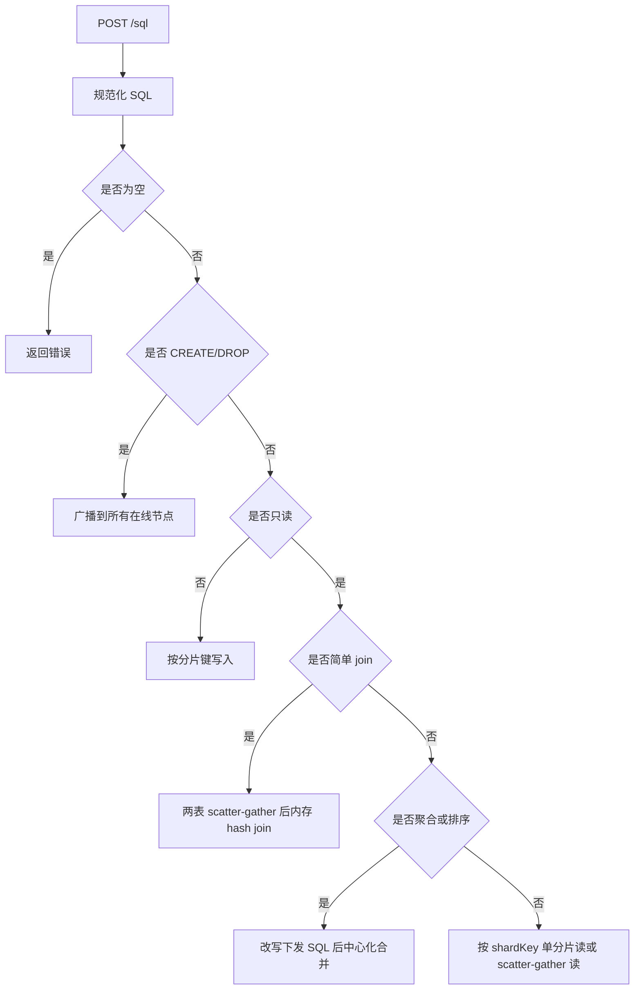
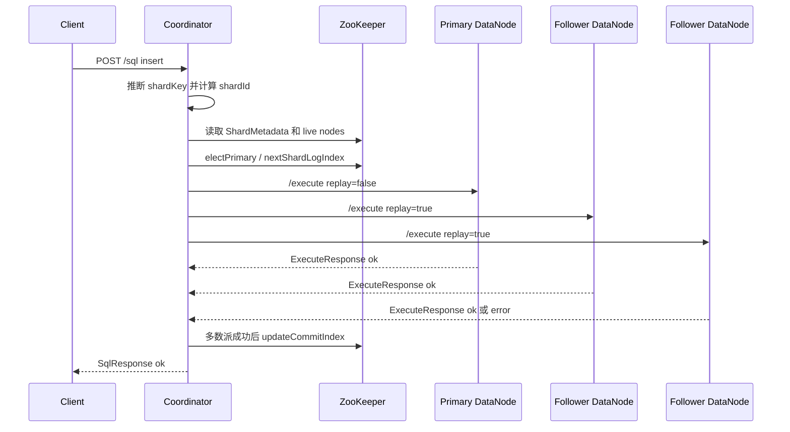
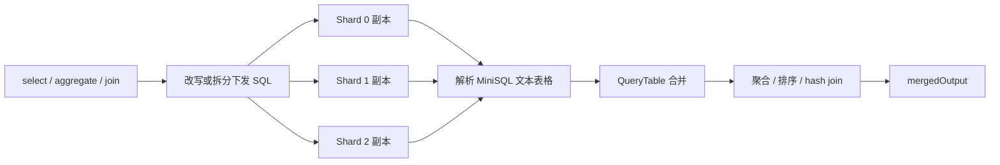
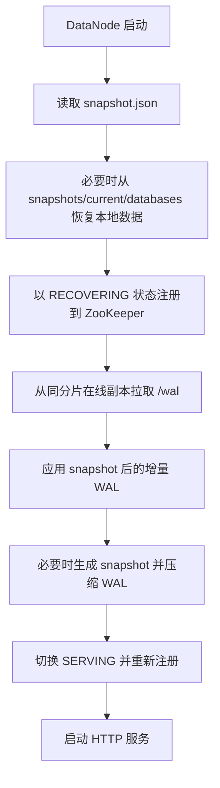
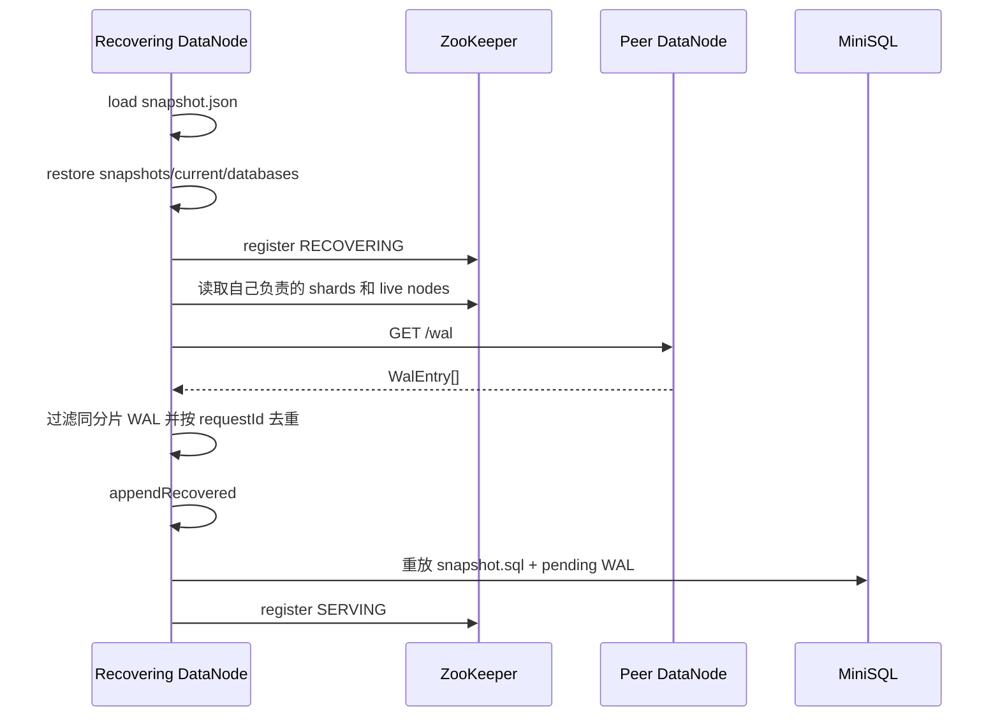

# 分布式 MiniSQL 系统设计报告

## 1. 项目目标

本项目在现有 `minisql/` C++ 单机数据库内核外实现一层 Java 分布式系统。MiniSQL 内核本身不提供事务、日志和分布式能力，因此本系统把分片、复制、容错恢复、查询协调、元数据管理和运维接口全部放在 Java 层实现，尽量保持底层 MiniSQL 不被侵入。

系统主要目标如下：

- 数据按分片键进行哈希分片，分布存储到多个 DataNode。
- 每个分片拥有多个副本，副本布局、在线节点、primary、term 和 commitIndex 由 ZooKeeper 管理。
- Coordinator 提供中心化 SQL 入口，负责路由写入、scatter-gather 读、读副本负载均衡和跨分片结果合并。
- Java DataNode 在 MiniSQL 外实现 WAL 和 snapshot，使节点宕机恢复后可以追赶离线期间缺失的写入。
- 支持三节点部署、单节点宕机后继续读写、故障节点恢复、动态扩容和 rebalance。
- 在作业规模内支持部分复杂查询，包括聚合、排序和简单等值 join。

设计取向是教学型分布式数据库：保留 GFS、BigTable、Raft 风格中最核心的思想，如中心化元数据、分片副本、多数派确认、日志追赶和健康检查；同时避免完整事务系统、完整 Raft 日志复制、SQL 优化器等超出 MiniSQL 内核能力的复杂实现。

## 2. 总体架构

系统由三类长期运行进程组成：

- Coordinator：中心协调节点，对外提供 HTTP SQL 和管理接口。它读取 ZooKeeper 中的分片元数据和在线节点信息，决定 SQL 应该发往哪些 DataNode。
- DataNode：数据节点，负责本地 WAL、snapshot 和 MiniSQL 子进程调用。每个 DataNode 只服务自己负责的分片副本。
- ZooKeeper：元数据和成员发现组件，保存分片副本表、分片日志序号和在线 DataNode 信息。DataNode 通过 ephemeral znode 注册，因此节点宕机后会自动从在线列表中消失。

整体结构如下：



Java 层和 C++ MiniSQL 内核之间的边界非常清晰：DataNode 不通过库调用 MiniSQL，而是使用 `ProcessBuilder` 启动 MiniSQL batch 模式，把需要重放和执行的 SQL 写入临时批处理文件，再由 MiniSQL 执行。这样可以把分布式逻辑全部保持在 `dis-minisql/` 工程中。

## 3. 模块划分

Java 工程位于 `dis-minisql/src/main/java/edu/minisql/distributed`，主要模块如下。

`DisMiniSql` 是命令行入口，支持三种角色：

- `init-zk <config>`：初始化 ZooKeeper 中的分片元数据。
- `datanode <config> <nodeId>`：启动指定 DataNode。
- `coordinator <config>`：启动 Coordinator。

`config` 模块负责加载集群配置。`ClusterConfig` 包含集群名、ZooKeeper 地址、分片数、副本因子、默认数据库、Coordinator 地址、MiniSQL 二进制路径和节点列表。`NodeConfig` 描述单个 DataNode 的 `nodeId`、`host`、`port` 和 `dataDir`。

`coordinator` 模块是查询入口和分布式执行核心。`CoordinatorServer` 暴露 HTTP 接口并实现 SQL 分类、写入路由、读请求分发、admin 运维接口。`ReplicaChooser` 实现读副本轮询和写副本过滤。`QueryPostProcessor`、`MiniSqlResultParser` 和 `QueryTable` 负责解析 MiniSQL 文本输出，并完成聚合、排序和 join 的中心化合并。

`datanode` 模块负责本地持久化和 MiniSQL 执行。`DataNodeServer` 暴露 `/execute`、`/wal`、`/health`、`/admin/refresh-shards`、`/admin/snapshot`。`WalLog` 和 `WalEntry` 实现 JSON Lines WAL。`SnapshotManager`、`SnapshotManifest` 和 `SnapshotMetadata` 维护 snapshot 文件、已压缩 WAL 序号和各分片追赶进度。

`zk` 模块负责 ZooKeeper 元数据访问。`ZkPaths` 定义路径约定，`ZkMetadataStore` 实现节点注册、分片初始化、分片读取、primary 选择、commitIndex 更新、shardLogIndex 分配和 rebalance。

`protocol` 模块定义 HTTP 请求和响应数据结构，包括 `SqlRequest`、`SqlResponse`、`ExecuteRequest`、`ExecuteResponse`、`NodeInfo` 和 `ShardMetadata`。

`common` 模块提供通用工具。`SqlUtils` 负责 SQL 规范化、读写分类、DDL 判断、INSERT 分片键推断和 SHA-256 分片计算。`HttpUtil` 和 `Jsons` 封装 HTTP JSON 读写和 Jackson 序列化。

`minisql` 模块中的 `MiniSqlCli` 负责调用 C++ MiniSQL 主程序。它会在 DataNode 工作目录中创建临时 SQL 文件，以 batch 模式执行重放 SQL 和当前 SQL，并设置超时时间。

## 4. 配置与部署模型

配置文件采用 JSON，核心字段包括：

- `clusterName`：ZooKeeper 根路径名称，例如 `dis-minisql` 或 `dis-minisql-e2e`。
- `zkConnect`：ZooKeeper 连接地址，例如 `127.0.0.1:2181`。
- `sessionTimeoutMs`：ZooKeeper 会话超时时间。
- `shardCount`：逻辑分片数量。
- `replicationFactor`：每个分片的副本数量。
- `defaultDatabase`：DataNode 调用 MiniSQL 时默认使用的数据库。
- `coordinatorHost` 和 `coordinatorPort`：Coordinator HTTP 监听地址。
- `minisqlBinary`：C++ MiniSQL 可执行文件路径。
- `nodes`：DataNode 列表，每个节点包含 `nodeId`、`host`、`port`、`dataDir`。

单机测试时，所有 DataNode 可以运行在 `127.0.0.1` 的不同端口上。三台真机部署时，只需把各节点 `host` 改成真实机器 IP，并在对应机器上启动自己的 DataNode。Coordinator 仍可以部署在任意一台机器，只要能访问 ZooKeeper 和各 DataNode HTTP 端口即可。

部署流程如下：



## 5. ZooKeeper 元数据设计

ZooKeeper 中的路径以 `/{clusterName}` 为根。例如 `clusterName=dis-minisql` 时，主要路径如下：

- `/dis-minisql/nodes/<nodeId>`：DataNode 在线信息，ephemeral 节点。内容是 `NodeInfo` JSON，包括节点地址、负责分片、WAL 序号、状态和各分片日志进度。
- `/dis-minisql/shards/<shardId>`：分片元数据，persistent 节点。内容是 `ShardMetadata` JSON，包括分片 ID、副本列表、primary、term 和 commitIndex。
- `/dis-minisql/shard-log-indexes/<shardId>`：每个分片的递增日志序号，persistent 节点。Coordinator 写入前通过该路径分配新的 `shardLogIndex`。

元数据关系如下：



分片初始化采用确定性轮转算法。节点 ID 排序后，分片 `s` 的第 `r` 个副本为：

```text
nodeIds[(s + r) mod nodeIds.size()]
```

例如三节点、三分片、副本因子为三时，初始布局为：

- shard 0：`node-a`、`node-b`、`node-c`
- shard 1：`node-b`、`node-c`、`node-a`
- shard 2：`node-c`、`node-a`、`node-b`

每个分片的首副本作为初始 primary，初始 term 为 `1`。这种布局算法简单、确定、便于复现，也能在节点数量不多时让副本大致均匀分布。

DataNode 注册使用 ephemeral znode。节点正常运行时会写入 `NodeInfo`；进程退出、宕机或 ZooKeeper 会话超时后，该 znode 会自动删除。Coordinator 每次路由时读取当前 live nodes，因此无需维护额外的心跳线程。

## 6. 分片策略

Coordinator 在写入时需要确定目标分片。分片键来源有两种：

- 客户端通过 `SqlRequest.shardKey` 显式传入。
- 对 `insert into ... values (...)` 语句，系统默认取第一列值作为分片键。

分片函数由 `SqlUtils.hashToShard` 实现：

```text
shardId = floorMod(first4Bytes(sha256(shardKey)), shardCount)
```

使用 SHA-256 而不是 Java `hashCode()` 的好处是结果更稳定，不依赖 JVM 版本，也能降低简单键值分布不均带来的影响。

DDL 语句不按分片键路由。`create` 和 `drop` 被识别为广播 DDL，Coordinator 会将其发送给所有在线 DataNode，以确保每个 DataNode 的 MiniSQL 本地 schema 一致。

## 7. Coordinator 设计

Coordinator 是系统的唯一 SQL 入口，核心类为 `CoordinatorServer`。它暴露以下接口：

- `POST /sql`：执行 SQL。
- `GET /metadata`：查看分片元数据。
- `GET /nodes`：查看当前在线 DataNode。
- `GET /admin/health`：返回在线节点和分片状态。
- `POST /admin/rebalance`：根据当前在线节点重新计算副本布局。
- `POST /admin/snapshot`：通知在线 DataNode 创建 snapshot 并压缩 WAL。

SQL 请求处理流程如下：



### 7.1 写请求处理

普通写请求只路由到一个逻辑分片，但会复制到该分片的多个副本。流程如下：

1. Coordinator 规范化 SQL，并从请求字段或 INSERT 第一列推断 `shardKey`。
2. 通过 SHA-256 分片函数计算 `shardId`。
3. 从 ZooKeeper 读取该 shard 的副本列表、primary、term 和 commitIndex。
4. 调用 `electPrimary`，如果当前 primary 不在在线 `SERVING` 节点中，则从副本列表中选择新的 `SERVING` 节点作为 primary，并递增 term。
5. 使用 `ReplicaChooser.chooseForWrite` 过滤出在线且状态为 `SERVING` 的副本。
6. 通过 ZooKeeper `/shard-log-indexes/<shardId>` 分配新的 `shardLogIndex`。
7. 生成全局唯一 `requestId`，向 primary 和 followers 发送 `/execute`。
8. 成功副本数达到多数派后，更新 ZooKeeper 中该 shard 的 `commitIndex` 并返回成功。

写请求链路如下：



这里的 Raft 是教学版多数派提交模型，而不是完整 Raft。系统保留了 primary、term、分片日志序号和多数派确认，但没有实现完整选举超时、日志回滚、成员变更联合共识等机制。

### 7.2 读请求处理

读请求分为单分片读和全分片读：

- 如果请求包含 `shardKey`，Coordinator 只访问对应 shard 的一个在线副本。
- 如果不包含 `shardKey`，Coordinator 对所有 shard 做 scatter-gather，每个 shard 选择一个在线副本执行同一查询。

读副本选择由 `ReplicaChooser` 维护 per-shard 轮询计数器。这样同一个分片的连续读请求会在多个在线副本之间轮转，避免所有读请求集中到 primary 或某一个固定副本上。

### 7.3 查询后处理

MiniSQL 子进程返回的是文本表格结果，而不是结构化 ResultSet。因此 Coordinator 使用 `MiniSqlResultParser` 解析 ASCII 表输出，将每个分片的结果转为内存中的 `QueryTable`。

中心化合并支持以下能力：

- 普通 `select`：列结构一致时，按行合并并去重。
- `order by`：下发到 DataNode 前去掉排序部分，Coordinator 汇总所有分片结果后统一排序。
- `count`、`sum`、`min`、`max`：下发为基础 `select * from <table>`，Coordinator 在内存中计算最终聚合值。
- 简单等值 join：识别形如 `select * from A join B on A.x = B.y` 的查询，分别读取左右表所有分片结果，在 Coordinator 内存中构建 hash join。

查询合并流程如下：



该设计优点是无需改造 MiniSQL 内核，能够快速支持分布式查询演示；缺点是所有复杂查询结果都要回到 Coordinator 内存中处理，不适合大结果集和复杂 SQL 优化。

## 8. DataNode 设计

DataNode 是分片副本的执行者，核心类为 `DataNodeServer`。每个 DataNode 对外提供：

- `POST /execute`：执行 Coordinator 下发的 SQL。
- `GET /wal`：返回本地 WAL，用于其他副本恢复追赶。
- `GET /health`：返回当前节点状态。
- `POST /admin/refresh-shards`：刷新自己负责的分片，进入恢复流程并追赶 WAL。
- `POST /admin/snapshot`：生成 snapshot 并压缩 WAL。

DataNode 启动流程如下：



DataNode 的状态字段 `replicaState` 主要有两个值：

- `RECOVERING`：节点正在启动、刷新分片或追赶 WAL。Coordinator 不应选择它处理正常读写。
- `SERVING`：节点已经完成恢复，可以处理读写。

### 8.1 `/execute` 执行流程

DataNode 收到 `ExecuteRequest` 后按请求类型处理：

- 非只读且 `replay=false`：说明这是正常写入。DataNode 会检查自己是否拥有目标 shard，并检查请求 term 是否过期；通过后先追加本地 WAL，再调用 MiniSQL 执行。
- `replay=true`：说明这是复制写入或恢复写入。DataNode 会根据 `requestId` 去重，已经存在的请求直接返回成功；否则追加为 recovered WAL 后执行。
- 只读 SQL：不追加 WAL，只用当前 snapshot 和 WAL 重放出逻辑状态，再执行查询。

DataNode 每次调用 MiniSQL 前，会构造需要重放的 SQL 列表：

1. 读取 `snapshots/current/snapshot.sql` 中已经压缩进 snapshot 的 SQL。
2. 读取 `wal.jsonl` 中 `sequence > lastCompactedWalSequence` 且早于当前请求的 WAL SQL。
3. 将上述 SQL 和当前 SQL 写入临时 batch 文件。
4. 调用 `minisql/build/bin/main --batch <file>`。

这样做的原因是 MiniSQL 内核的进程级数据恢复能力有限。Java 层把 snapshot SQL 和 WAL 当作权威逻辑状态，每次执行时通过重放重建本地状态，从而绕开 MiniSQL 缺少日志和事务系统的问题。

### 8.2 本地文件布局

每个 DataNode 的 `dataDir` 下包含以下关键文件：

- `wal.jsonl`：JSON Lines WAL，每行一条 `WalEntry`。
- `wal-index.json`：WAL 索引，保存本地最后一个 `sequence` 和已见过的 `requestId`，用于去重和恢复加载。
- `snapshot.json`：snapshot manifest，保存 `lastWalSequence`、`lastCompactedWalSequence`、创建时间和各分片最大 `shardLogIndex`。
- `snapshots/current/snapshot.sql`：已经进入 snapshot 的 SQL 序列。
- `snapshots/current/databases/`：从 MiniSQL 本地 `databases/` 目录复制出来的逻辑快照数据。
- `databases/`：MiniSQL 当前工作数据目录。

## 9. WAL 与 Snapshot 设计

WAL 条目由 `WalEntry` 表示，包含：

- `sequence`：本 DataNode 本地递增序号。
- `requestId`：Coordinator 为一次写入生成的全局请求 ID。多个副本收到同一写入时使用同一个 `requestId`。
- `shardId`：所属分片。广播 DDL 使用 `-1`。
- `shardLogIndex`：该分片上的全局递增日志序号，由 ZooKeeper 分配。
- `sql`：规范化后的 SQL。
- `timestampMillis`：写入时间。

WAL 设计有三个目的：

- 写前记录：非只读请求先写 WAL，再执行 MiniSQL。
- 幂等去重：恢复、重放或 follower 写入时用 `requestId` 避免重复执行同一逻辑请求。
- 跨节点追赶：恢复节点从其他副本 `/wal` 拉取同分片日志，补齐离线期间缺失的操作。

Snapshot 的目标是避免 WAL 无限增长。DataNode 每次执行后会检查：

```text
lastSequence - lastCompactedWalSequence >= 20
```

如果达到阈值，就把当前已应用 SQL 写入 `snapshot.sql`，复制当前 `databases/` 到 `snapshots/current/databases/`，然后把已包含进 snapshot 的 WAL 压缩掉。管理员也可以通过 `/admin/snapshot` 主动触发 snapshot。

恢复流程如下：



该机制保证“节点无正在执行任务时宕机，恢复后补执行离线期间其他副本已执行操作”的场景可以最终一致。它不解决单条 SQL 执行到一半时进程崩溃的事务原子性问题，因为底层 MiniSQL 不提供事务提交协议。

## 10. 副本一致性与容错

系统采用简化的 Raft 风格多数派写入模型。每个 shard 在 ZooKeeper 中记录：

- `replicas`：副本节点列表。
- `primary`：当前主副本。
- `term`：主副本任期。
- `commitIndex`：已经被多数派确认的最大 `shardLogIndex`。

写入时 Coordinator 会先确认 primary 是否在线且处于 `SERVING` 状态。如果不是，就从副本列表中选择第一个在线 `SERVING` 副本作为新 primary，并递增 term。

Coordinator 发送写请求时，primary 收到 `replay=false` 请求，followers 收到 `replay=true` 请求。DataNode 会把请求写入 WAL，并根据 `requestId` 保证幂等。只要成功副本数达到：

```text
quorum = replicaCount / 2 + 1
```

Coordinator 就认为写入成功，并推进 shard 的 `commitIndex`。

单节点宕机时，ZooKeeper 会删除该节点的 ephemeral znode。Coordinator 后续读取 live nodes 时不会再选择该节点，只要剩余副本仍能形成多数派，写入就可以继续成功。故障节点恢复后会先进入 `RECOVERING`，从仍在线的同分片副本拉取 WAL 并重放，完成后才切换回 `SERVING`。

## 11. 动态扩容与 Rebalance

当新 DataNode 加入集群时，它会先以 `RECOVERING` 状态注册到 ZooKeeper。管理员调用 Coordinator 的：

```text
POST /admin/rebalance
```

Coordinator 会读取当前 live nodes，并调用 `ZkMetadataStore.rebalance` 重新计算每个 shard 的副本集合。rebalance 使用与初始化相同的轮转策略，只是输入节点集合变成当前在线节点。如果副本集合变化，则更新 `ShardMetadata`，必要时调整 primary 并递增 term。

随后 Coordinator 会通知所有在线节点：

```text
POST /admin/refresh-shards
```

DataNode 收到后会重新读取自己负责的分片，进入 `RECOVERING`，从有重叠分片的其他副本拉 WAL，应用缺失日志，再切回 `SERVING`。

扩容流程如下：

```mermaid
flowchart TD
    StartD[启动 node-d] --> RegisterD[node-d 注册 RECOVERING]
    RegisterD --> Admin[调用 /admin/rebalance]
    Admin --> Recalc[ZooKeeper 重算 shard replicas]
    Recalc --> Refresh[Coordinator 调用各节点 /admin/refresh-shards]
    Refresh --> Pull[新旧节点按新分片集合拉取 WAL]
    Pull --> Serving[恢复完成后注册 SERVING]
    Serving --> Health[/admin/health 可见新副本布局]
```

当前 rebalance 策略是简单轮转分布，适合作业和演示场景。它没有实现热点感知、一致性哈希、分片迁移限速或 Raft 成员变更联合共识。

## 12. 运维接口

Coordinator 运维接口包括：

- `/admin/health`：返回当前在线 DataNode 和所有 shard 元数据，可观察 primary、term、commitIndex、副本状态、WAL 序号和 shardLogIndex。
- `/admin/rebalance`：根据当前在线节点重新计算分片副本，并通知节点刷新分片。
- `/admin/snapshot`：通知所有在线 DataNode 创建 snapshot 并压缩 WAL。

DataNode 运维接口包括：

- `/health`：返回当前节点的 `NodeInfo`。
- `/wal`：返回本地 WAL，用于恢复和排查。
- `/admin/refresh-shards`：刷新分片归属并追赶 WAL。
- `/admin/snapshot`：本节点主动创建 snapshot。

这些接口既用于自动化测试，也方便手工排查。项目中提供 `dis-minisql/scripts/health.sh`、`admin.sh`、`sql.sh` 等脚本封装常见调用。

## 13. MiniSQL 调用设计

DataNode 通过 `MiniSqlCli` 调用 C++ MiniSQL，不直接链接 C++ 代码。执行方式是：

1. 在 DataNode 工作目录中创建临时目录和临时 SQL 文件。
2. 写入需要重放的 SQL 列表。
3. 写入当前请求 SQL。
4. 调用 MiniSQL batch 模式。
5. 捕获标准输出和错误输出，作为 `ExecuteResponse.output` 返回给 Coordinator。

对于有默认数据库的配置，`MiniSqlCli` 会在合适场景下插入 `use <defaultDatabase>`，使 DataNode 不需要每次请求都显式携带数据库上下文。

这种方式的优点是实现简单、对 MiniSQL 内核侵入低；缺点是每次执行都可能涉及进程启动和 SQL 重放，性能不如常驻连接或嵌入式调用。考虑到作业重点是分布式逻辑而非单机执行性能，这一取舍是可接受的。

## 14. 测试设计

系统提供两类测试方式。

自动化端到端测试脚本是 `dis-minisql/scripts/e2e_system_test.py`。它会自动启动临时 ZooKeeper、三个初始 DataNode 和 Coordinator，执行建库建表、多数派写入、聚合、排序、join、单节点故障、第四节点扩容、rebalance、health、snapshot 和最终查询。

手动测试脚本位于 `dis-minisql/scripts/`，包括：

- `prepare-manual-runtime.sh`：生成运行目录、`zoo.cfg`、`cluster3.json` 和 `cluster4.json`。
- `start-zookeeper-manual.sh`：启动测试 ZooKeeper。
- `init-zk-manual.sh`：初始化 ZooKeeper 元数据。
- `start-node-manual.sh`：启动指定 DataNode。
- `start-coordinator-manual.sh`：启动 Coordinator。
- `sql.sh`：向 Coordinator 执行 SQL。
- `health.sh`：查看 Coordinator 或 DataNode 健康状态。
- `admin.sh`：调用 health、rebalance、snapshot。
- `stop-manual-test.sh`：停止测试进程但保留日志。
- `run-manual-e2e.sh`：串联完整手动测试流程。

测试覆盖点如下：

- 三节点启动和 ZooKeeper 注册。
- DDL 广播。
- 基于分片键的写入路由。
- 三副本多数派写入。
- 聚合、排序和简单 join 的 Coordinator 合并。
- 停止一个 DataNode 后继续写入。
- 启动第四个 DataNode 后 rebalance。
- snapshot 和 WAL 压缩入口。
- 故障和扩容后的最终查询一致性。

## 15. 设计取舍与局限

本系统优先满足课程作业中的分布式功能展示，因此做了若干有意识的简化。

一致性方面，系统实现的是教学版多数派提交和最终一致恢复，不是完整 Raft。它没有实现日志冲突回滚、leader 选举超时、投票、联合共识和严格线性一致读。

事务方面，底层 MiniSQL 没有事务系统，因此系统不支持跨分片事务，也不保证单条 SQL 在 MiniSQL 进程中途崩溃时的原子性。WAL 主要用于节点恢复后的重放追赶。

查询方面，复杂查询采用 Coordinator 中心化处理。它适合小规模演示，但在大数据量下会受到 Coordinator 内存、网络传输和 MiniSQL 文本解析的限制。

存储方面，WAL 和 snapshot 以 SQL 重放为核心。这种方式直观、可检查，适合教学项目；生产系统通常会使用物理日志、LSN、校验和、更严格的快照一致性协议。

扩容方面，当前 rebalance 使用简单轮转策略，没有根据数据量、热点、磁盘容量或网络带宽做智能调度。

## 16. 后续改进方向

后续可以从以下方向继续扩展：

- 实现更完整的 Raft 日志复制，包括 leader 选举、日志匹配、冲突回滚和 commitIndex 推进。
- 引入分片迁移任务状态机，使 rebalance 支持限速、重试和可观测进度。
- 增加 SQL parser，替代当前基于正则和简单文本解析的查询识别方式。
- 将聚合下推到 DataNode，减少 Coordinator 汇总的数据量。
- 为 WAL 增加校验和、截断恢复和更严格的幂等语义。
- 支持范围分片或一致性哈希，改善扩容时的数据迁移规模。
- 增加 Prometheus 指标、结构化日志和更完整的故障注入测试。
